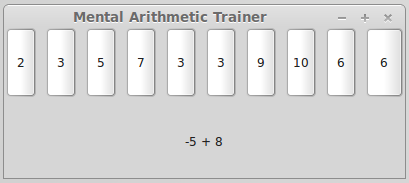

mental_arithmetic_trainer
=========================

Opens a window and shows a simple arithmetic equation in the lower half.
In the upper half ten buttons are displayed with possible solutions. At least one of them offers the correct solution :)

If you click the wrong answer, nothing happens.
In case of the correct answer, a new equation is generated and new solution buttons are displayed.

For simplicities sake only the following arithmetical operations are provided:
```
x + y
x - y
x * y
x / y
```

